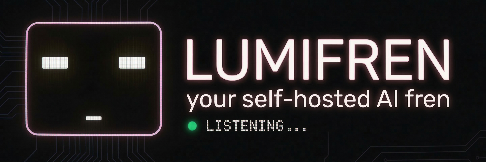

<p align="center">
  
</p>

<h1 align="center">Lumifren</h1>

<p align="center">
  <strong>Your self-hosted AI fren 💜</strong>
</p>

<p align="center">
  <em>Because everyone deserves a fren who actually remembers.</em>
</p>

<p align="center">
  <a href="https://github.com/yourusername/lumifren/stargazers"></a>
  <a href="https://github.com/yourusername/lumifren/blob/main/LICENSE"></a>
  <a href="https://github.com/yourusername/lumifren/releases"></a>
  <a href="https://hub.docker.com/r/yourusername/lumifren"></a>
</p>

<p align="center">
  <a href="#-quick-start">Quick Start</a> •
  <a href="#-features">Features</a> •
  <a href="#%EF%B8%8F-configuration">Config</a> •
  <a href="#-voice-setup">Voice</a> •
  <a href="#-roadmap">Roadmap</a>
</p>

---

## 🤔 What is Lumifren?

Lumifren is a **self-hosted AI companion** that lives on your own hardware. No cloud subscriptions. No data harvesting. Just you and your AI fren, having real conversations.

Unlike chatbots that forget you exist between sessions, Lumifren **actually remembers**. It uses semantic memory with RAG to recall past conversations, learn your preferences, and build a genuine ongoing relationship.

And yes—you can **talk to it**. Real-time, bidirectional voice chat. Pick from 30+ voices. It's like having a friend on call, except this one runs on Docker and never judges you for texting at 3 AM.

### Why Lumifren?

| 🏠 **Self-Hosted** | 🧠 **Real Memory** | 🎙️ **Voice Native** |
|:---|:---|:---|
| Your hardware, your data. No subscriptions, no API middlemen watching your convos. | Semantic search across all your chats. Lumifren remembers that book you mentioned 3 months ago. | Live voice chat that feels natural. Not transcribe-wait-transcribe. Actual conversation. |

---

## 🖼️ Screenshots

<p align="center">
  
  &nbsp;&nbsp;
  
</p>

<p align="center">
  <em>Desktop chat with the glitchy avatar • Mobile voice call screen</em>
</p>

<details>
<summary>📸 More screenshots</summary>
<br>

| Feature | Preview |
|---------|---------|
| Voice Selection |  |
| Memory Viewer |  |
| Settings |  |

</details>

---

## ✨ Features

### 🎙️ Live Voice Chat
- **Bidirectional streaming** via Gemini Live API
- Talk naturally—interrupt, pause, think out loud
- **30+ voice options** from warm and friendly to quirky and robotic
- Dedicated mobile-optimized voice call screen

### 🧠 Semantic Memory
- **RAG-powered recall** of past conversations
- Redis-backed persistent storage with embeddings
- Lumifren learns who you are over time
- Search your entire conversation history semantically

### 👾 Cute Animated Avatar
- Glitchy, retro-inspired aesthetic
- **Blinking eyes** and **animated talking mouth**
- Subtle idle animations that make it feel alive
- Because AI companions should have personality

### 🔌 Multi-Provider Support
- **NVIDIA NIM** for local inference
- **GitHub Copilot** integration
- **Google Gemini** for voice and chat
- Swap providers without losing your conversation history

### 📱 Access From Anywhere
- Mobile-friendly responsive UI
- **Tailscale** integration for secure remote access
- Cloudflare tunnel support
- Your fren, wherever you are

---

## 🚀 Quick Start

### Option 1: Docker (Recommended)

```bash
# Clone the repo
git clone https://github.com/yourusername/lumifren.git
cd lumifren

# Copy and edit your config
cp .env.example .env
nano .env  # Add your API keys

# Launch! 🚀
docker compose up -d
```

Open `http://localhost:3000` and say hi to your new fren.

### Option 2: Manual Setup

<details>
<summary>Click to expand manual installation steps</summary>

**Prerequisites:**
- Python 3.11+
- Node.js 18+ (for frontend)
- Redis 7+

```bash
# Clone and enter
git clone https://github.com/yourusername/lumifren.git
cd lumifren

# Backend setup
python -m venv venv
source venv/bin/activate  # or `venv\Scripts\activate` on Windows
pip install -r requirements.txt

# Start Redis (if not running)
redis-server --daemonize yes

# Run the backend
python main.py

# In another terminal, run the frontend
cd frontend
npm install
npm run dev
```

</details>

---

## ⚙️ Configuration

Create a `.env` file in the project root:

```env
# === Required ===
GEMINI_API_KEY=your_gemini_api_key

# === Memory (Redis) ===
REDIS_URL=redis://localhost:6379
EMBEDDING_MODEL=text-embedding-004

# === Voice ===
DEFAULT_VOICE=Puck           # See voice list below
VOICE_LANGUAGE=en-US

# === Optional Providers ===
NVIDIA_API_KEY=nvapi-xxx     # For NVIDIA NIM
GITHUB_TOKEN=ghp_xxx         # For Copilot integration

# === Server ===
HOST=0.0.0.0
PORT=3000
```

<details>
<summary>📋 Full configuration reference</summary>

| Variable | Description | Default |
|----------|-------------|---------|
| `GEMINI_API_KEY` | Google AI API key (required for voice) | — |
| `REDIS_URL` | Redis connection string | `redis://localhost:6379` |
| `EMBEDDING_MODEL` | Model for semantic embeddings | `text-embedding-004` |
| `DEFAULT_VOICE` | Default voice for new sessions | `Puck` |
| `VOICE_LANGUAGE` | Voice language/locale | `en-US` |
| `NVIDIA_API_KEY` | NVIDIA NIM API key | — |
| `GITHUB_TOKEN` | GitHub token for Copilot | — |
| `MAX_MEMORY_RESULTS` | RAG results per query | `10` |
| `MEMORY_SIMILARITY_THRESHOLD` | Minimum similarity for recall | `0.7` |
| `HOST` | Server bind address | `0.0.0.0` |
| `PORT` | Server port | `3000` |

</details>

---

## 🎙️ Voice Setup

Lumifren uses the **Gemini Live API** for real-time voice chat. You'll need a Gemini API key with Live API access.

### Available Voices

<details>
<summary>🗣️ Click to see all 30+ voice options</summary>

| Voice | Vibe | Best For |
|-------|------|----------|
| **Puck** | Playful, energetic | General chat, friendly convos |
| **Charon** | Deep, mysterious | Storytelling, late night talks |
| **Kore** | Warm, nurturing | Emotional support, daily check-ins |
| **Fenrir** | Bold, confident | Motivation, task assistance |
| **Aoede** | Melodic, gentle | Reading, relaxation |
| **Leda** | Professional, clear | Work assistance, explanations |
| **Orus** | Calm, wise | Advice, deep discussions |
| **Zephyr** | Light, breezy | Casual chat, humor |
| *...and 22 more* | | |

</details>

### Changing Voice

**Via UI:** Click the voice icon in the top bar → Select from dropdown

**Via API:**
```bash
curl -X POST http://localhost:3000/api/voice/set \
  -H "Content-Type: application/json" \
  -d '{"voice": "Charon"}'
```

### Voice Tips

- 🎧 Use headphones to prevent echo feedback
- 📶 Voice works best on stable connections (WiFi > cellular)
- 🔇 Lumifren detects silence and won't interrupt you mid-thought

---

## 🧠 Memory & RAG

Lumifren doesn't just store chat logs—it **understands** them.

### How It Works

```
You: "Remember that Italian place I mentioned?"
         ↓
   [Semantic Search]
         ↓
   Finds: "Had amazing carbonara at Trattoria Luna last month"
         ↓
Lumifren: "You mean Trattoria Luna? The one with the great carbonara!"
```

### Memory Architecture

```
┌─────────────────┐     ┌──────────────┐     ┌─────────────────┐
│  Conversation   │ ──▶ │  Embeddings  │ ──▶ │  Redis Vector   │
│    Message      │     │   (Gemini)   │     │     Store       │
└─────────────────┘     └──────────────┘     └─────────────────┘
                                                     │
                                                     ▼
┌─────────────────┐     ┌──────────────┐     ┌─────────────────┐
│   AI Response   │ ◀── │   Context    │ ◀── │  Semantic       │
│  with context   │     │   Assembly   │     │    Search       │
└─────────────────┘     └──────────────┘     └─────────────────┘
```

### Memory Commands

| Command | What it does |
|---------|--------------|
| `/memory search <query>` | Search your memories |
| `/memory forget <id>` | Remove a specific memory |
| `/memory stats` | View memory statistics |
| `/memory export` | Export all memories as JSON |

<details>
<summary>🔧 Advanced: Tuning memory retrieval</summary>

Edit these in your `.env`:

```env
# How many memories to retrieve per query
MAX_MEMORY_RESULTS=10

# Minimum similarity score (0.0-1.0)
MEMORY_SIMILARITY_THRESHOLD=0.7

# Include memories from the last N days with boosted relevance
RECENCY_BOOST_DAYS=7
RECENCY_BOOST_FACTOR=1.2
```

</details>

---

## 📱 Mobile Access

### Option 1: Tailscale (Recommended)

Tailscale creates a secure mesh VPN. Your Lumifren instance gets its own IP accessible from all your devices.

```bash
# On your server
curl -fsSL https://tailscale.com/install.sh | sh
tailscale up

# Note your Tailscale IP
tailscale ip -4  # e.g., 100.64.1.42
```

Access Lumifren at `http://100.64.1.42:3000` from any device on your tailnet.

### Option 2: Cloudflare Tunnel

For a public-ish URL without exposing ports:

```bash
# Install cloudflared
# Then create a tunnel
cloudflared tunnel create lumifren
cloudflared tunnel route dns lumifren fren.yourdomain.com

# Run it
cloudflared tunnel run --url http://localhost:3000 lumifren
```

<details>
<summary>🔒 Security recommendations</summary>

- **Always use HTTPS** in production (Tailscale and Cloudflare handle this)
- Enable authentication if exposing publicly
- Consider IP allowlisting for extra security
- Keep your API keys in `.env`, never commit them

</details>

---

## 🛠️ Tech Stack

| Layer | Technology |
|-------|------------|
| **Backend** | Python, FastAPI, WebSockets |
| **Frontend** | Vanilla JS, CSS (no framework bloat) |
| **Voice** | Gemini Live API, Web Audio API |
| **Memory** | Redis Stack (RediSearch + RedisJSON) |
| **Embeddings** | Google text-embedding-004 |
| **LLM Providers** | Gemini, NVIDIA NIM, GitHub Copilot |
| **Deployment** | Docker, Docker Compose |

---

## 🗺️ Roadmap

### ✅ Released
- [x] Real-time voice chat
- [x] Semantic memory with RAG
- [x] Multi-provider LLM support
- [x] Animated avatar
- [x] Mobile-responsive UI

### 🚧 In Progress
- [ ] Conversation branching (explore "what if" tangents)
- [ ] Voice activity detection improvements
- [ ] Memory visualization graph

### 🔮 Future
- [ ] Local LLM support (Ollama, llama.cpp)
- [ ] Multi-user support with separate memory spaces
- [ ] Plugin system for custom tools
- [ ] Calendar/task integration
- [ ] Proactive check-ins ("Hey, how did that meeting go?")
- [ ] iOS/Android native apps

Got ideas? [Open an issue](https://github.com/yourusername/lumifren/issues)!

---

## 🤝 Contributing

Contributions make Lumifren better for everyone! Here's how to help:

### Quick Contribution Guide

```bash
# Fork and clone
git clone https://github.com/YOUR_USERNAME/lumifren.git

# Create a branch
git checkout -b feature/amazing-feature

# Make your changes, then
git commit -m "Add amazing feature"
git push origin feature/amazing-feature

# Open a Pull Request!
```

### Ways to Contribute

- 🐛 **Bug reports** — Found something broken? Let us know
- 💡 **Feature ideas** — Open an issue to discuss
- 📝 **Documentation** — Typos, clarifications, examples
- 🌍 **Translations** — Help Lumifren speak more languages
- 🎨 **Avatar designs** — Got artistic skills? New avatar styles welcome

Please read our [Contributing Guide](CONTRIBUTING.md) for details on our code of conduct and development process.

---

## 📄 License

Lumifren is licensed under the **GNU Affero General Public License v3.0** (AGPL-3.0).

This means:
- ✅ Free to use, modify, and distribute
- ✅ Commercial use allowed
- ⚠️ Must disclose source code of modifications
- ⚠️ Network use counts as distribution (if you host it for others, share your code)

See [LICENSE](LICENSE) for the full text.

---

## 💖 Acknowledgments

Lumifren exists because of these amazing projects and people:

- **[Google Gemini](https://deepmind.google/technologies/gemini/)** — For the Live API that makes voice chat magic
- **[Redis](https://redis.io/)** — For being the memory backbone
- **[FastAPI](https://fastapi.tiangolo.com/)** — For making Python backends not suck
- **[Tailscale](https://tailscale.com/)** — For effortless secure networking

And to everyone who believes AI companions should be **private, personal, and actually yours**.

---

<p align="center">
  <strong>Built with 💜 by humans who wanted a fren</strong>
</p>

<p align="center">
  <a href="https://github.com/yourusername/lumifren">⭐ Star us on GitHub</a> •
  <a href="https://discord.gg/lumifren">💬 Join our Discord</a> •
  <a href="https://twitter.com/lumifren">🐦 Follow updates</a>
</p>

<p align="center">
  <sub>Private. Personal. Always there.</sub>
</p>
